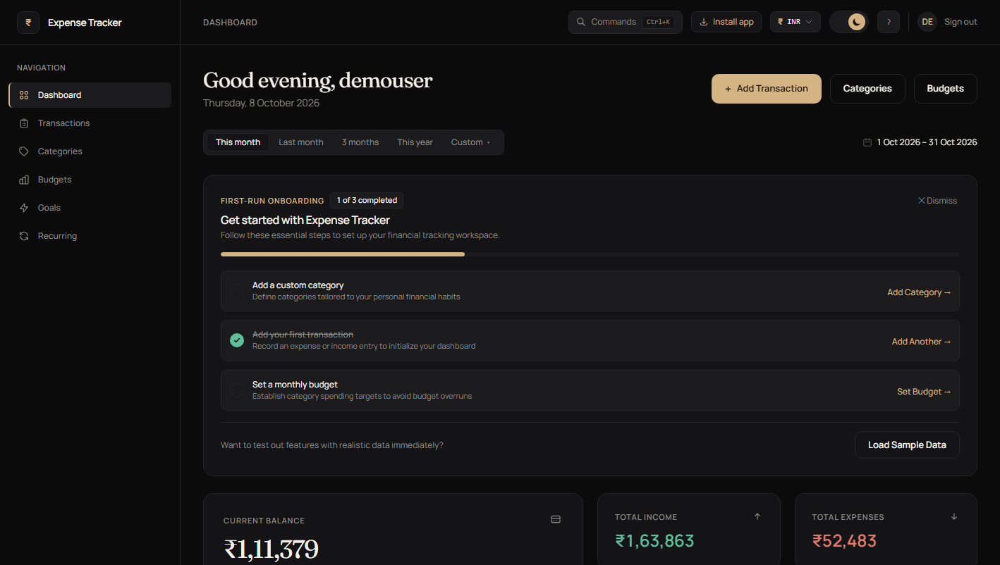
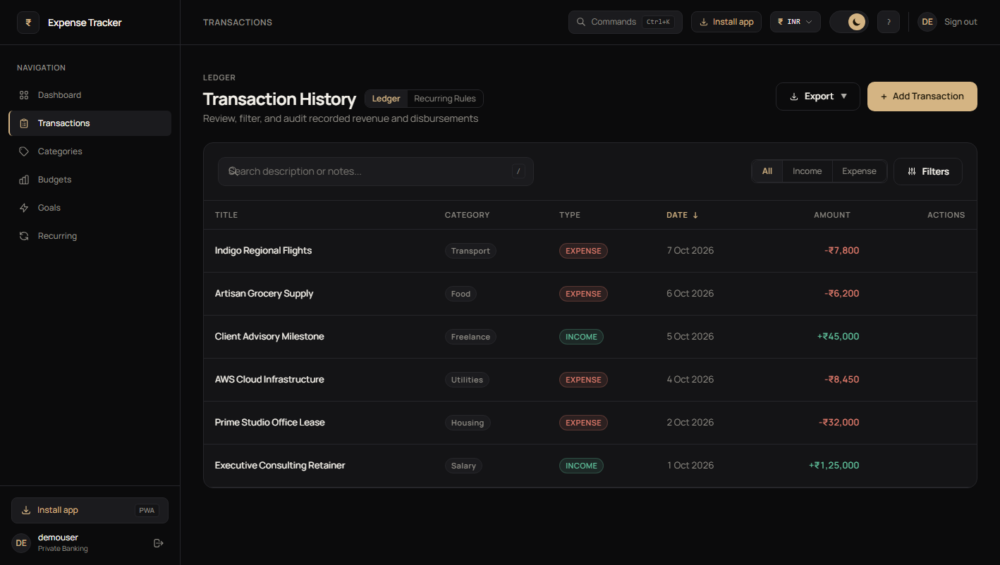
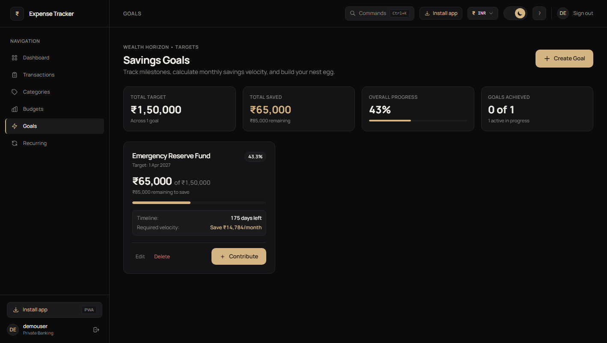
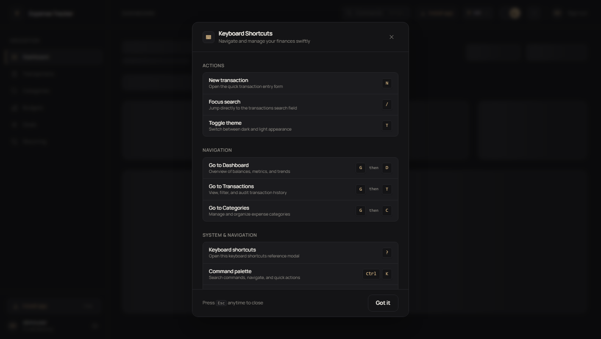

# 💰 Expense Tracker Web App

[](https://reactjs.org/)
[](https://vitejs.dev/)
[](https://tailwindcss.com/)
[](https://www.python.org/)
[](https://flask.palletsprojects.com/)
[](https://neon.tech/)
[](https://web.dev/progressive-web-apps/)

An enterprise-grade, full-stack personal finance application designed with an **Obsidian & Champagne** private banking aesthetic. It empowers users to track income and disbursements, establish category budgets, achieve savings goals, scan receipts with OCR, convert currencies, and navigate lightning-fast with global keyboard shortcuts and a fuzzy command palette.

---

## 📸 Screenshots Showcase

### 📊 Modern Financial Dashboard
*A quiet, high-density overview featuring real-time balances, income/expense metrics, first-run onboarding checklist, and trend analytics.*



---

### 📑 Comprehensive Transaction Ledger
*Auditable ledger with instant debounced search, multi-category filters, date/amount ranges, and one-click CSV / PDF export.*



---

### 🎯 Savings Goals & Wealth Horizon
*Set financial targets, track milestones with real-time velocity calculations ("Save ₹14,784/month"), and celebrate completed targets.*



---

### ⌨️ Global Keyboard Shortcuts & Command Palette
*Navigate seamlessly with Vim-style sequential keys (`G` then `D`/`T`/`C`), quick actions (`N`, `/`, `T`), and a global Command Palette (`Ctrl+K`).*



---

## ✨ Key Features

### 💎 Design & User Experience
* **Obsidian & Champagne Aesthetic**: Tailored dark (`#0B0B0C`) and warm ivory light theme with flat cards, 1px subtle borders, and zero glowing distractions.
* **Modern Typography**: Elegant pairing of `Fraunces` editorial serif with crisp `Manrope` sans-serif.
* **Progressive Web App (PWA)**: Installable natively on iOS, Android, macOS, and Windows with offline caching and service worker support.

### 💵 Transaction Management
* **Income & Expense Tracking**: Log entries with custom categories, payment notes, and dates.
* **Smart Category Suggestion**: Heuristics and past merchant learning auto-suggest categories as you type the description.
* **OCR Receipt Scanning**: Upload an image or capture a receipt via camera to auto-extract amount, date, and vendor details.
* **Soft Deletions**: 6-second undo toast preventing accidental record removal.
* **Export Ledger**: Export filtered records to formatted CSV or PDF reports.

### 🌐 Multi-Currency Support
* **Global Currencies**: Full support for **INR (₹)** with Indian digit grouping (`1,00,000`), **USD ($)**, **EUR (€)**, and **GBP (£)**.
* **Real-time Conversion**: Automatically stores transactions in their native entry currency while maintaining converted base amounts.
* **Custom Rates**: Automatically fetches or allows manual override of exchange rates, cached daily.

### 🎯 Financial Planning & Automation
* **Savings Milestones**: Target deadlines, progress bars, and required monthly saving rates to hit each milestone.
* **Category Budgets**: Set spending ceilings per category with visual threshold warnings.
* **Recurring Automation**: Automate subscriptions, rent, and recurring income schedules.
* **Spending Insights & Forecasts**: Mathematical predictive cash-flow forecasting based on 30-day run rates.

### ⚡ Power-User Keyboard Navigation
* **`N`**: Open New Transaction dialog from anywhere.
* **`/`**: Focus transactions search bar immediately.
* **`G` then `D` / `T` / `C`**: Jump sequentially to Dashboard, Transactions, or Categories.
* **`T`**: Instant toggle between Dark and Light themes.
* **`?`**: Open the on-screen Keyboard Shortcuts reference cheat-sheet.
* **`Ctrl+K` / `⌘K`**: Fuzzy Command Palette for quick navigation and actions.
* **Input-Safe**: All single-letter shortcuts are automatically bypassed while typing in forms.

---

## ⌨️ Keyboard Shortcuts Reference

| Shortcut | Action | Description |
| :--- | :--- | :--- |
| <kbd>N</kbd> | New Transaction | Open quick transaction entry modal |
| <kbd>/</kbd> | Focus Search | Focus and select transaction ledger search input |
| <kbd>G</kbd> then <kbd>D</kbd> | Go to Dashboard | Navigate to `/dashboard` |
| <kbd>G</kbd> then <kbd>T</kbd> | Go to Transactions | Navigate to `/transactions` |
| <kbd>G</kbd> then <kbd>C</kbd> | Go to Categories | Navigate to `/categories` |
| <kbd>T</kbd> | Toggle Theme | Switch between dark Obsidian and light Ivory |
| <kbd>?</kbd> | Shortcuts Guide | Display keyboard shortcuts modal |
| <kbd>Ctrl</kbd> + <kbd>K</kbd> / <kbd>⌘K</kbd> | Command Palette | Open fuzzy command palette |
| <kbd>Esc</kbd> | Dismiss / Close | Close open modals, palette, or drop-downs |

---

## 🛠️ Tech Stack

### Frontend
* **Core**: React 18, Vite 6
* **Styling**: Tailwind CSS v4, Vanilla CSS Custom Properties (Design Tokens)
* **Routing & State**: React Router v7, React Context API (`CurrencyContext`, `DarkModeContext`, `CategoriesContext`, `AppRefreshContext`)
* **Utilities**: Canvas Confetti, Tesseract OCR client, PWA Service Worker

### Backend
* **Language & Framework**: Python 3.10+, Flask 3
* **Database & ORM**: PostgreSQL (Neon Serverless) & SQLite fallback via Flask-SQLAlchemy
* **Authentication**: JWT (JSON Web Tokens) with HTTP-only refresh cookies and bcrypt hashing
* **Reporting**: ReportLab (PDF generation) & native CSV generator
* **Rate Limiting**: Custom token-bucket rate limiter for authentication routes

---

## 🏗️ Project Architecture

```text
expense-tracker-web-app/
├── backend/
│   ├── routes/
│   │   ├── auth_routes.py         # Registration, login, JWT refresh, rate limits
│   │   ├── budget_routes.py       # Monthly category spending limits
│   │   ├── category_routes.py     # Category CRUD and default seeds
│   │   ├── currency_routes.py     # Base currency & exchange rates
│   │   ├── forecast_routes.py     # Cash-flow run rate forecasting
│   │   ├── goal_routes.py         # Savings goals & progress calculations
│   │   ├── receipt_routes.py      # OCR receipt upload & heuristics parsing
│   │   ├── recurring_routes.py    # Recurring rules and automation
│   │   └── transaction_routes.py  # Ledger CRUD, filters, CSV/PDF exports
│   ├── utils/
│   │   ├── auth.py                # Token verification and decorators
│   │   ├── currency_service.py    # Exchange rate caches & conversions
│   │   ├── csv_generator.py       # Formatted CSV report generation
│   │   ├── pdf_generator.py       # PDF summary generation with ReportLab
│   │   ├── receipt_parser.py      # OCR image analysis and regex extractors
│   │   └── migration.py           # Safe database migrations
│   ├── app.py                     # Main Flask application entry point
│   ├── config.py                  # Database configuration
│   ├── models.py                  # SQLAlchemy schema definitions
│   └── requirements.txt           # Python backend dependencies
├── frontend/
│   ├── public/
│   │   ├── icons/                 # PWA icons (192x192, 512x512, maskable)
│   │   ├── manifest.json          # Web app manifest
│   │   └── sw.js                  # Service Worker with offline caching
│   ├── src/
│   │   ├── components/
│   │   │   ├── layout/AppShell.jsx# Responsive sidebar, header & global shortcuts
│   │   │   ├── CommandPalette.jsx # Fuzzy search command palette
│   │   │   ├── ShortcutsHelpModal.jsx # Keyboard shortcuts guide dialog
│   │   │   ├── CurrencySelector.jsx # Multi-currency selector & switcher
│   │   │   ├── DarkModeToggle.jsx # Theme switcher
│   │   │   ├── InstallAppButton.jsx # PWA prompt installer
│   │   │   └── TransactionForm.jsx # Entry form with OCR receipt scanning
│   │   ├── context/               # Global state contexts
│   │   ├── hooks/
│   │   │   └── useKeyboardShortcuts.js # Global shortcut event listener
│   │   ├── pages/                 # Dashboard, Transactions, Goals, Budgets, etc.
│   │   ├── services/api.js        # Axios instance with auto-refresh interceptors
│   │   ├── App.jsx                # Protected routes & app shell provider
│   │   └── index.css              # Obsidian & Champagne design tokens
│   ├── package.json               # Frontend dependencies & scripts
│   └── vite.config.js             # Vite proxy and configuration
├── docs/
│   └── screenshots/               # Application preview screenshots
└── README.md                      # Project documentation
```

---

## ⚙️ Getting Started

### Prerequisites
* **Node.js**: v18 or later
* **Python**: v3.10 or later
* **PostgreSQL** (optional; SQLite works out-of-the-box)

---

### 1. Clone the Repository

```bash
git clone https://github.com/Rudradev02/expense-tracker-web-app.git
cd expense-tracker-web-app
```

---

### 2. Backend Setup

1. Navigate to the backend directory:
   ```bash
   cd backend
   ```

2. Create and activate a Python virtual environment:
   ```bash
   # Windows
   python -m venv venv
   venv\Scripts\activate

   # macOS / Linux
   python3 -m venv venv
   source venv/bin/activate
   ```

3. Install required Python packages:
   ```bash
   pip install -r requirements.txt
   ```

4. Configure environment variables in `backend/.env`:
   ```env
   DATABASE_URL=sqlite:///database.db
   SECRET_KEY=your_secure_random_jwt_secret_key
   ACCESS_TOKEN_MINUTES=15
   REFRESH_TOKEN_DAYS=7
   FLASK_ENV=development
   ```

5. Launch the backend server:
   ```bash
   python app.py
   ```
   *The backend will start on `http://127.0.0.1:5000`.*

---

### 3. Frontend Setup

1. Open a new terminal and navigate to `frontend`:
   ```bash
   cd frontend
   ```

2. Install Node dependencies:
   ```bash
   npm install
   ```

3. Start the Vite development server:
   ```bash
   npm run dev
   ```

4. Open `http://localhost:5173` (or the port specified by Vite) in your browser.

---

## 🔐 Environment Variables Reference

| Variable | Scope | Description | Default |
| :--- | :--- | :--- | :--- |
| `DATABASE_URL` | Backend | Connection string (PostgreSQL or SQLite) | `sqlite:///database.db` |
| `SECRET_KEY` | Backend | Cryptographic secret for signing JWTs | *Required in production* |
| `ACCESS_TOKEN_MINUTES` | Backend | Expiration window for access tokens | `15` |
| `REFRESH_TOKEN_DAYS` | Backend | Expiration window for refresh token cookies | `7` |
| `VITE_BACKEND_URL` | Frontend | Target backend API URL | `http://127.0.0.1:5000` |

---

## 📡 API Overview

| Method | Endpoint | Description |
| :--- | :--- | :--- |
| `POST` | `/register` | Create a new user account and issue tokens |
| `POST` | `/login` | Authenticate user and set HTTP-only cookie |
| `POST` | `/refresh` | Rotate access token using refresh cookie |
| `GET` | `/transactions` | List user transactions with filters, search, and pagination |
| `POST` | `/transactions` | Record a new transaction (with multi-currency conversion) |
| `GET` | `/export?format=csv\|pdf` | Export transaction ledger in CSV or PDF format |
| `POST` | `/scan-receipt` | Upload image for OCR text and amount extraction |
| `POST` | `/suggest-category` | Auto-suggest category based on merchant and description |
| `GET` | `/goals` | Retrieve all savings goals with velocity metrics |
| `POST` | `/goals` | Create a new savings milestone |
| `POST` | `/goals/<id>/contribute` | Log a contribution toward a goal |
| `GET` | `/budgets` | Fetch monthly category budget limits and utilization |
| `GET` | `/currencies` | Retrieve base currency settings and exchange rates |

---

## 👨‍💻 Author

**Rudra Kumbhani**
* GitHub: [@Rudradev02](https://github.com/Rudradev02)

---

⭐ **Enjoying Expense Tracker? Star the repository on GitHub!**
